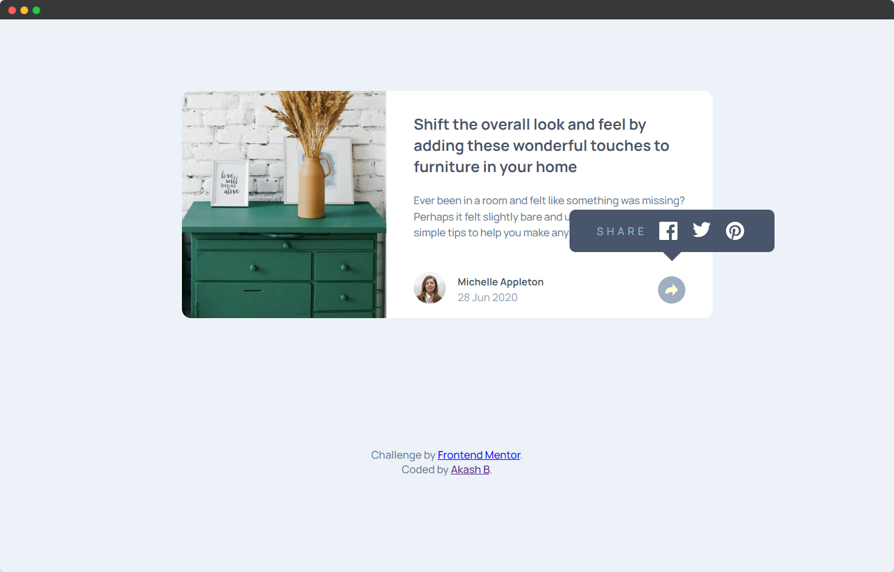

# Frontend Mentor - Article preview component solution

This is a solution to the [Article preview component challenge on Frontend Mentor](https://www.frontendmentor.io/challenges/article-preview-component-dYBN_pYFT).
## Table of contents

- [Frontend Mentor - Article preview component solution](#frontend-mentor---article-preview-component-solution)
  - [Table of contents](#table-of-contents)
    - [The challenge](#the-challenge)
    - [Screenshot](#screenshot)
    - [Links](#links)
    - [Built with](#built-with)
  - [Author](#author)

### The challenge

Users should be able to:

- View the optimal layout for the component depending on their device's screen size
- See the social media share links when they click the share icon

### Screenshot

**Desktop**

**Mobile**

### Links

-  [Solution](https://www.frontendmentor.io/solutions/article-prewview-component-uPYCDrsq04)
-  [Live Site](https://akash02ab.github.io/article-preview/)

### Built with

- Semantic HTML5 markup
- CSS custom properties
- Flexbox
- Mobile-first workflow

## Author

- Website - [Akash B.](https://akashbanchhor.netlify.app)
- Frontend Mentor - [@yourusername](https://www.frontendmentor.io/profile/akash02ab)
